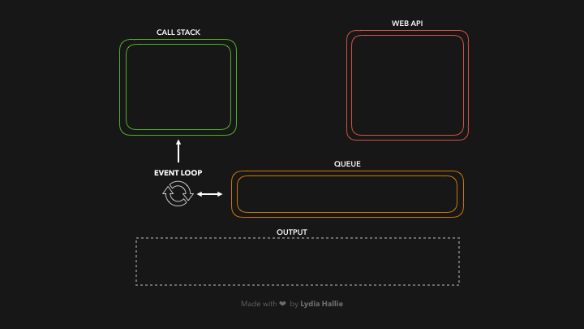

# 第三周学习总结

今天这篇文章要讲的是在 JavaScript 中一个很重要的知识点： 事件循环。结合一篇国外的开发者写的特别优秀的文章，来整理总结。

## 图解事件循环

_本部分内容翻译自[原文](https://dev.to/lydiahallie/javascript-visualized-event-loop-3dif),作者 Lydia Hallie。_


JavaScript 是单线程的，所谓单线程意味着一次只能运行一个任务。通常情况下这没什么大不了的，但是想象一下如果你正在运行一个任务而且这个任务需要耗时 30 秒，在这 30s 时间结束之前我们没有办法做任何事情（因为 JavaScript 运行在默认浏览器的主线程,所以整个 UI 被阻塞了）。

幸运的是，浏览器为我们提供了一些 JavaScript 引擎本身没有提供的特性: Web API。这包括 DOM API、setTimeout、HTTP 请求等等。这可以帮助我们创建一些异步非阻塞行为。

当我们调用一个函数时，它被添加到调用堆栈中（压栈）。调用堆栈是 JS 引擎的一部分，这不是浏览器特有的。它是一个堆栈，意味着它是第一个进来的，最后一个出来的(想想一堆煎饼)。当一个函数返回一个值,它被从栈中弹出（出栈）。


respond 函数返回一个 setTimeout 函数。setTimeout 是由 Web API 提供的: 它允许我们在不阻塞主线程的情况下延迟任务。我们传递给 setTimeout 函数的回调箭头函数()=> {return 'Hey'}被添加到 Web API 中。与此同时，setTimeout 函数和 respond 函数从堆栈中弹出，它们都返回了它们的值!


在 Web API 中，一个计时器模块（timer）的运行时间与传递给它的第二个参数时间一样长，即 1000ms。回调不会立即添加到调用堆栈中，而是传递给称为队列的东西（排队问询）。


这可能是一个令人困惑的部分: 它并不意味着在 1000ms 之后将回调函数直接添加到调用栈(然后返回一个值)!它只是在 1000ms 后添加到队列中。因为它是一个队列，函数必须排队，等待轮到它!


回调被添加到调用堆栈中，被调用，并返回一个值，然后从堆栈中弹出。


来看一个具体例子

```javascript
const foo = () => console.log("First");
const bar = () => setTimeout(() => console.log("Second"), 500);
const baz = () => console.log("Third");

bar();
foo();
baz();
```

让我们快速查看一下在浏览器中运行这段代码时发生了什么



整个流程的执行结果如下

1. 我们调用函数 bar,bar() 返回一个 setTimeout 函数。
2. 我们传递给 setTimeout 的回调被添加到 Web API 中，setTimeout 函数和 bar 被弹出 callstack。
3. 计时器运行，同时 foo 被调用并打印 “First” 。foo 返回(undefined,没有 return)，baz 被调用。
4. baz() 打印 ”Third”。事件循环在 baz 返回后看到 callstack 为空，然后将回调添加到调用堆栈中。
5. 回调里打印 ”Second”。

通过以上这部分，可以初步理解事件循环的基本原理。下面是一些自己的学习总结和实践。

## 事件循环学习总结和实践

监测代码的事件循环可以在[此平台](http://latentflip.com/loupe/)上实时查看，一个很好的平台。

### 事件循环(eventlop)中的任务(task)

1. 一个简单的总结是：每一段 JS 代码(有待考证)都是一个微任务，不同的微任务构成了一个宏任务；执行在 JS 引擎里的就是微任务，执行在 JS 引擎之外的就是宏任务，循环宏任务的工作就是事件循环。

   拿浏览器举例：setTimeout、setInterval 这种其实不是 JS 语法本身的 API，是 JS 的宿主“浏览器”提供的 API， 所以是宏任务。而 Promise 是 JS 本身自带的 API，这种就是微任务。所以，也可以说宿主提供的方法是宏任务，JS 自带的是微任务。

1. 一个宏任务中，只存在一个微任务队列，根据入队时间决定各微任务执行顺序，并且所有的**同步代码**会合并到一个微任务中。

1. 任务列表里面有很多宏任务，然后每个宏任务里面有一个微任务列表，执行第二个宏任务之前会把第一个宏任务内部的微任务执行完。

1. Promise 的作用是在队列循环中插队一个要立即执行的事件，生成一个异步任务，也就是说，在没有 Promise 的时代，基本上没有微任务一说，因为所有同步代码都会被合并到一起作为一个微任务。

1. js 只能活在宿主环境里，例如浏览器和 node，微任务控制权在 js 引擎, 宏任务控制权在宿主, 这样 js 就方便跨语言传递信息。

ps: 在实际应用场景中，script 标签不是 js 本身的功能，通过 script 标签引入的一个 js 资源中的所有内容会被归到一个宏任务中，所以在浏览器中常常说页面的渲染是从上往下的，并且 js 的文件引入需要放在 body 标签最后。如果我们的一个宏任务中代码最后没有返回值，执行完这个宏任务后会自动返回一个 undefined，所以我们可以把一个 undefined 作为一个宏任务的结束标记。

### 几个例子

1. 例 1：所有代码都是同步的

   ```javascript
   function func1() {
     console.log("执行到我了：**" + 1 + "**"); // @1
   }

   function func2() {
     console.log("执行到我了：**" + 2 + "**"); // @2
   }

   func1();
   func2();
   console.log("执行到我了：**" + 3 + "**"); // @3
   ```

   打印结果是：@1-->@2-->@3

2. 加入 setTimeout

   ```javascript
   function func1() {
     console.log("执行到我了：**" + 1 + "**"); // @1
     setTimeout(() => console.log("执行到我了：**" + 1.1 + "**"), 500); // @2
     setTimeout(() => console.log("执行到我了：**" + 1.2 + "**"), 499); // @3
   }

   function func2() {
     console.log("执行到我了：**" + 2 + "**"); // @4
     setTimeout(() => console.log("执行到我了：**" + 2.1 + "**"), 0); // @5
   }

   func1();
   func2();
   console.log("执行到我了：**" + 3 + "**"); // @6
   setTimeout(() => console.log("执行到我了：**" + 3.1 + "**"), 500); // @7
   ```

   打印结果是：@1-->@4-->@6-->@5-->@3-->@2-->@7。从这里可以看到 1，4，6 属于同步代码会先后执行，2，3，5，7 各自生成一个异步任务在之后执行，由于 5 的延时时间为 0，所以最先执行，2 和 3 在同一个函数里，2 虽然比 3 执行，但是 3 时间较短先被执行，2 和 7 延迟时间相同，2 先执行，7 最后执行。

3. 改造原来的例子，加入 Promise

   ```javascript
   function func1() {
     console.log("执行到我了：**" + 1 + "**"); // @1
     setTimeout(() => console.log("执行到我了：**" + 1.1 + "**"), 500); //@2
   }

   function func2() {
     console.log("执行到我了：**" + 2 + "**"); // @3
     setTimeout(() => console.log("执行到我了：**" + 2.1 + "**"), 0); // @4
   }

   func1();
   console.log("执行到我了：**" + 3 + "**"); // @5
   new Promise((resolve, reject) => {
     console.log("执行到我了：**" + 3.1 + "**"); // @6
     resolve();
   }).then(() => {
     let before = (now = new Date().valueOf());
     while ((now - before) / 1000 < 10) {
       now = new Date().valueOf();
     }
     console.log("执行到我了：**" + 3.2 + "**"); // @7
   });
   func2();
   ```

   打印结果是：@1-->@5-->@6-->@3-->@7-->@4-->@2。这个例子比较可以说明问题：func1、func2 和 new Promise 都属于同步代码，所以 1，5，6，3 可以理解为一个微任务，7 是 Promise 生成的异步任务，是另外一个微任务，4 和 2 是另外两个宏任务中的微任务。在执行 7 之前，阻塞了线程 10s，此时 4 和 2 仍然未执行，直到 7 执行后，即下一个的宏任务的执行必须要前面的宏任务执行完毕。

4. 加入 async，await

   ```javascript
   async function func1() {
     console.log("执行到我了：**" + 1 + "**"); // @1
     await func2();
     setTimeout(() => console.log("执行到我了：**" + 1.1 + "**"), 500); //@2
     console.log("执行到我了：**" + 1.3 + "**"); // @3
   }

   async function func2() {
     console.log("执行到我了：**" + 2 + "**"); // @4
     setTimeout(() => console.log("执行到我了：**" + 2.1 + "**"), 500); // @5
   }

   func1();
   new Promise((resolve, reject) => {
     console.log("执行到我了：**" + 3.1 + "**"); // @6
     resolve();
   }).then(() => {
     console.log("执行到我了：**" + 3.2 + "**"); // @7
   });
   ```

   打印结果是：@1-->@4-->@6-->@3-->@7-->@2-->@5。在这个例子中，func1(),await func2(),new Promise 属于同步代码，所以 1，4，6 是一个微任务，await 后面的代码和 Promise 的 then 中的回调函数是两个不同的异步代码块，生成两个微任务，其中由于不同的浏览器下优先级不一致，微任务的执行顺序不一样，chrome 浏览器下是以调用顺序为先，先调用的先执行，而在 safari 下 await 的优先级更高，会优先执行（只看到现象，待验证）

## 理解事件循环的意义
